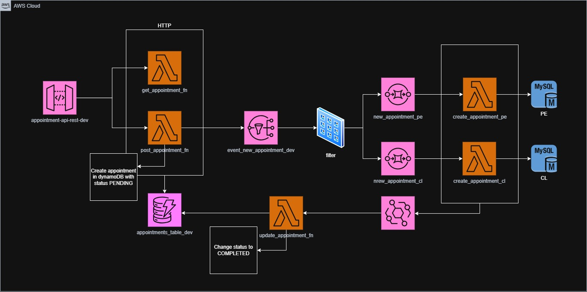

# 📅 Appointment Service



Servicio Serverless para la gestión de citas, desarrollado con AWS Lambda y desplegado mediante AWS SAM. Este microservicio permite la creación, consulta y gestión de citas en un entorno escalable y altamente disponible.

---

## 🚀 Tecnologías

- Node.js + TypeScript
- AWS Lambda
- AWS API Gateway
- AWS EventBridge
- AWS SNS
- AWS SQS
- AWS DynamoDB
- AWS RDS
- AWS SAM (Serverless Application Model)
- Jest (pruebas unitarias)

---

## 📂 Estructura del Proyecto

```
appointment-service/
│
├── docs/                    # Documentación (Swagger, diagramas, etc.)
│   ├── architecture.jpg
│   ├── swagger.yml
│   └── swagger-ui/
│
├── events/                  # Eventos de ejemplo para pruebas locales
│   ├── createAppointmentApiEvent.json
│   ├── createAppointmentSqsEvent.json
│   ├── getAppointmentsByInsuredId.json
│   └── updateAppointment.json
│
├── packages/
│   ├── shared/              # Paquete local compartido entre Lambdas
│   │   ├── src/
│   │   │   ├── interfaces/
│   │   │   │   ├── appointment.ts
│   │   │   │   └── infrastructure/
│   │   │   │       ├── eventBridge/
│   │   │   │       ├── database/
│   │   │   │       └── sns/
│   │   │   ├── utils/
│   │   │   ├── aws/
│   │   │   └── enums/
│   │   ├── dist/
│   │   ├── coverage/
│   │   └── ...
│   └── shared-tmp/          # Carpeta temporal para empaquetado del shared
│
├── scripts/                 # Scripts de automatización
│   ├── build-shared.sh
│   ├── deploy-dev.sh
│   └── test-all.sh
│
├── src/
│   └── functions/
│       ├── http/            # Lambdas expuestas vía API Gateway
│       │   ├── get_appointment_fn/
│       │   └── post_appointment_fn/
│       └── sqs/             # Lambdas disparadas por SQS
│           ├── create_appointment_fn/
│           └── update_appointment_fn/
│
├── template.yaml            # Definición de recursos AWS SAM
├── samconfig.dev.toml       # Configuración para entorno dev
├── samconfig.tmp.toml       # Configuración temporal
├── README.md
└── .gitignore
```

- Las funciones Lambda están organizadas por tipo de disparador (`http` para API Gateway, `sqs` para colas).
- El paquete `@/shared` contiene utilidades, interfaces y lógica común reutilizable.
- Los eventos de ejemplo en `/events` permiten pruebas locales rápidas.
- Los scripts en `/scripts` automatizan tareas como el empaquetado del shared y la ejecución de tests.

---

## 📦 Paquete compartido `@/shared`

La carpeta `@/shared` es un paquete local que contiene código y utilidades compartidas entre las diferentes funciones Lambda del proyecto.

Para asegurarte de que las funciones Lambda utilicen la versión más reciente de este paquete, debes ejecutar el script:

```bash
bash scripts/build-shared.sh
```

Este script se encargará de compilar el paquete, empaquetarlo y actualizarlo automáticamente en todas las funciones Lambda correspondientes.

---

## 📐 Patrones de Diseño

Este proyecto implementa los patrones de diseño **Factory** y **Strategy** para manejar la lógica de creación de citas de acuerdo al país (`countryISO`). Esto permite que el comportamiento del sistema sea fácilmente configurable y extensible sin modificar la lógica central.

### 🏭 Factory + Strategy

- **Factory**: La clase `AppointmentStrategyFactory` selecciona y retorna la estrategia correspondiente de acuerdo al código ISO del país. Además, implementa una caché interna para evitar múltiples instancias de una misma estrategia.
- **Strategy**: Cada país define su propia lógica de creación de citas implementando la interfaz `CountryAppointmentStrategy`. Esto encapsula el comportamiento específico de cada país.

### 📂 Archivos principales

- `appointmentStrategyFactory.ts`  
  Se encarga de seleccionar e instanciar la estrategia adecuada según el país (`countryISO`).

- `ChileAppointmentStrategy.ts`  
  Define la lógica para agendar citas en Chile.

- `PeruAppointmentStrategy.ts`  
  Define la lógica específica para Perú.

### ✨ Beneficios

- **Extensibilidad**: Agregar soporte para un nuevo país requiere únicamente implementar una nueva clase de estrategia y registrarla en la configuración.
- **Reutilización**: Las dependencias comunes como el repositorio, logger y publicador de eventos son inyectadas por la factoría.
- **Bajo acoplamiento**: La lógica de negocio varía por país sin modificar el flujo general de creación de citas.

### 🧩 Ejemplo de uso

```ts
const strategy = AppointmentStrategyFactory.getStrategy('CL');
await strategy.create(appointment);
```

## ⚙️ Instalación y Despliegue

### 🔧 Requisitos previos

- Node.js ≥ 20.x
- AWS CLI configurado (`aws configure`)
- AWS SAM CLI instalado

### 🛠 Instalación

```bash
git clone https://github.com/jessdev-looroh/appointment-service.git
cd appointment-service
yarn
```

### 🚢 Despliegue con SAM

Si se tiene un archivo de configuración:

```bash
sam build --beta-features
sam deploy --guided --config-file samconfig.dev.toml  #tenemos un archivo de configuración dependiendo del ambiente
```
Si no se tiene un archivo de configuración:

```bash
sam build --beta-features
sam deploy --guided
```

Durante el `--guided`, puedes configurar:

- Nombre del stack
- Región AWS
- Parámetros como stage (`dev`, `prod`), etc.

---

## 📮 Endpoints disponibles

Al final del despliegue, deberías ver algo como 

```bash
Outputs
--------------------------------------------------------------------------------------------------
Key                 AppointmentApiGateway
Description         Base URL de la API Gateway
Value               https://a1b2c3d4.execute-api.us-east-1.amazonaws.com/dev
```

> Base URL: `https://{api-id}.execute-api.{region}.amazonaws.com/{stage}/`

### Crear una cita

```
POST api/appointments
```

**Body ejemplo:**
```json
{
    "insuredId": "00002",
    "scheduleId": 8,
    "countryISO": "PE"
}
```

---

### Obtener citas por id del asegurado

```
GET api/appointments/{insuredId}
```

---

## 🧪 Ejecutar tests de todas las Lambdas

Este proyecto incluye un script para ejecutar automáticamente los tests de todas las funciones Lambda que tengan una carpeta `tests` con archivos de prueba.

### 🔧 Requisitos

* Tener instalado `yarn`.
* Tener TypeScript y Jest configurado en cada Lambda.

### 🚀 Ejecución

Desde la raíz del proyecto, ejecuta:

```bash
bash test-all.sh
```

Este comando:

* Busca todas las carpetas que contengan un `package.json`.
* Verifica si existe un directorio `tests` con archivos `.ts` o `.js`.
* Ejecuta los tests usando `yarn test`.
* Muestra mensajes de éxito o advertencia según el estado de los tests.

---

## 🧪 Eventos de prueba

Los eventos de ejemplo para pruebas locales se encuentran en la carpeta `@/events`. Puedes utilizarlos para probar las Lambdas de forma local con el siguiente comando:

```bash
sam local invoke {NombreDeLaFuncion} -e events/{nombreDelEvento}.json
```

Reemplaza `{NombreDeLaFuncion}` por el nombre de la función Lambda que deseas probar y `{nombreDelEvento}.json` por el archivo de evento correspondiente, por ejemplo:

```bash
sam local invoke CreateAppointmentFunction -e events/createAppointmentApiEvent.json
```

---

## 📌 Variables de entorno

Se definen dentro del archivo de configuración `samconfig.dev.toml` y puedes sobrescribirlas en tiempo de despliegue. 


## 👨‍💻 Autor

**Jess Figueroa**  
[GitHub @jessdev-looroh](https://github.com/jessdev-looroh)

---

## 📄 Licencia

MIT